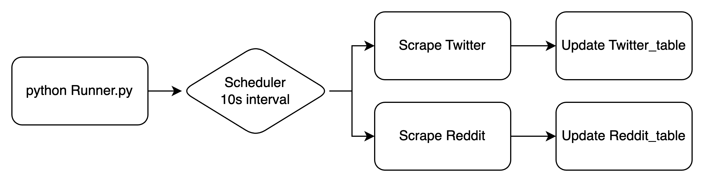
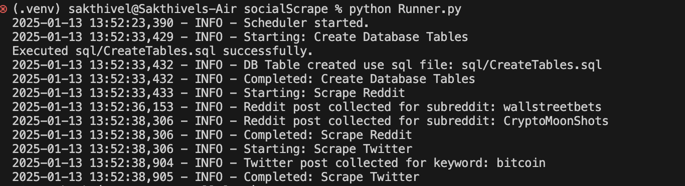
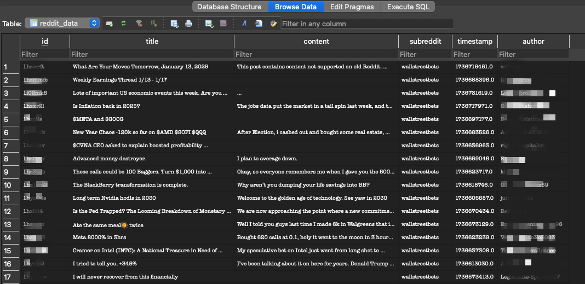

# Social Scrape
Scrape Reddit and Twitter data tags to sql db

#### Data flow design chart


#### Run project

##### Prerequisites:
- Obtain API keys and tokens for Twitter and Reddit:
- Twitter: Create an app via the [Twitter Developer Portal](https://developer.x.com/en) and obtain API keys.
- Reddit: Create an app via the [Reddit Developer Portal](https://www.reddit.com/prefs/apps) and get client ID and secret.

##### Instructions to replicate
- Step 1: Set to python 3.7++. use venv
- Step 2: Create a .env file at root with the following variables created

```
TWIT_APIKEY=
TWIT_APISECRET=
TWIT_BEARER=
TWIT_ACCESSTOKEN=
TWIT_ACCESSSECRET=

REDDIT_SECERET=
REDDIT_CLIENTID=
```

- Step 3: Install requirements
```
pip install -r requirements.txt
```
- Step 4: Run Project
```
python Runner.py
```


Expected result: Reddit and Twitter data will be scraped on a 10second scheduled interval. 

*note at present Twitter free tier heavily limits querying to 100 reads per mth. To increase limits would require higher tier Paid API subscription. 

Tables in DB Browser for Sqlite


resultant sqlite local DB can be found in results folder. Use DB Browser or other sql visualiser tools to browse the DB.
